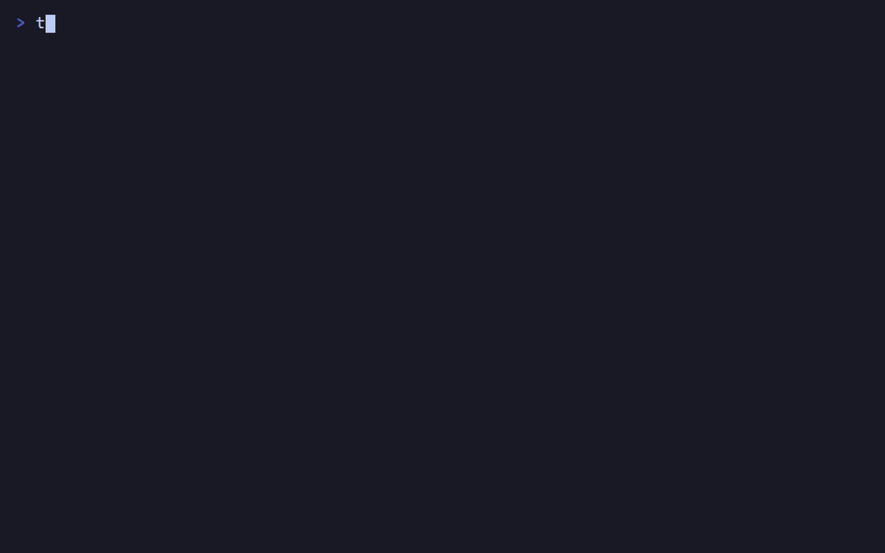

# Tetrus

A cross-platform terminal based Tetris game (inspired by [tetr.io](https://tetr.io/)) built in Rust using Ratatui.

## Demo



## Installation

### Windows (Winget)

```powershell
winget install JoseIgnacioGC.tetrus
```

### Linux & Cross-Platform (Cargo Binstall / Cargo)

Install the pre-compiled binary instantly with [cargo-binstall](https://github.com/cargo-bins/cargo-binstall):

```bash
cargo binstall tetrus
```

Or build and install from source:

```bash
cargo install tetrus
```

## License

This project is licensed under the [MIT License](LICENSE).

